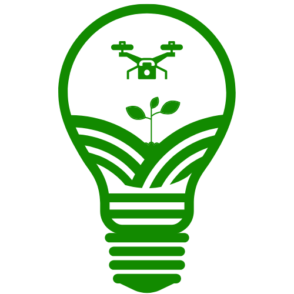

# 🌱 I&A AgroTech – Inovação no Campo

Bem-vindo ao projeto **I&A AgroTech**, uma plataforma de comércio eletrônico voltada para o agronegócio, focada na comercialização de produtos tecnológicos como tratores, drones agrícolas e pulverizadores. O objetivo principal é conectar produtores rurais a soluções modernas e eficientes para impulsionar sua produção com inovação.

---

## 🚀 Funcionalidades

- Cadastro e autenticação de usuários e administradores
- Navegação por categorias de produtos
- Carrinho de compras interativo
- Gestão de estoque e administradores
- Histórico de pedidos e área do perfil
- Página de contato, sobre, favoritos e muito mais
- Sistema de avaliação de produtos
- Acessibilidade e semântica HTML5 aplicada

---

## 📦 Estrutura do Projeto

O projeto é composto por páginas HTML5 responsivas, com foco em estrutura semântica, acessibilidade e design limpo. Utiliza imagens ilustrativas e ícones personalizados:

| Ícone | Descrição |
|-------|-----------|
|  | Drone agrícola inteligente |
|  | Inovação no campo com agricultura de precisão |

---

## 🧠 Tecnologias Utilizadas

- HTML5 com semântica acessível
- CSS3 responsivo
- Ícones e imagens SVG/PNG otimizados
- Estrutura modular de páginas

---

## 👤 Mascote do Projeto

O mascote representa a conexão entre tradição e tecnologia no campo, sendo um símbolo amigável da nossa proposta.

---

## 📫 Contato

Caso tenha dúvidas ou sugestões, entre em contato via e-mail: **ia@email.com**

---

© 2025 I&A AgroTech – Todos os direitos reservados.
