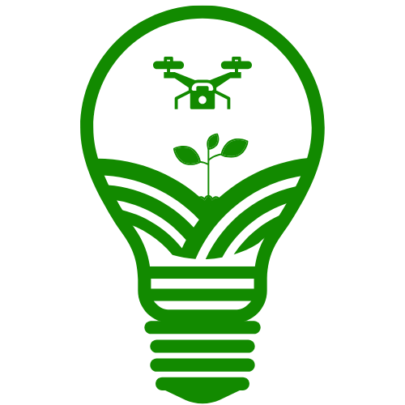
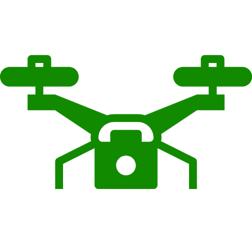

# 🌱 I&A – Inovação & Agricultura

  

Bem-vindo ao marketplace I&A. Este projeto tem como foco, a construção de um e-commerce que realize a venda de tratores, drones agrícolas e pulverizadoes que sejam de marcas de confiança e do mais alto nível tecnológico do mercado de maquinário agrícola.
---

## Funcionalidades

- Cadastro e autenticação de usuários e administradores
- Visualização de categorias de produtos e produtos 
- Carrinho de compras
- Gestão de estoque e administradores
- Histórico de pedidos e área do perfil
- Página de contato, sobre, favoritos
- Avaliação de produtos
- Dashboards

É importante ressaltar que o projeto tem como foco ser apenas visual, então nenhuma interação além de visualização e navegação é possível.

---

## Estrutura do Projeto

O projeto é composto por páginas HTML5, construídas juntamente com CSS3 com foco em estrutura semântica, acessibilidade e design limpo.

---

## Tecnologias Utilizadas

- HTML5
- CSS3

---

## Mascote do Projeto

  

Klink é nosso mascote, e ele foi escolhido pois representa a inovação dentro do setor do agronegócio com a implantação de drones e como eles podem transformar o négocio de diversos produtores rurais, assim como nossa loja também pode.

---

## Link para protótipo

https://www.figma.com/design/koetAUREMpgE5JVstyI0mx/Integrador?node-id=1-2&t=9b7L9gMX3EIiwzhm-1

---

## Contato

Caso tenha dúvidas ou sugestões, não exite em entrar em contato!

